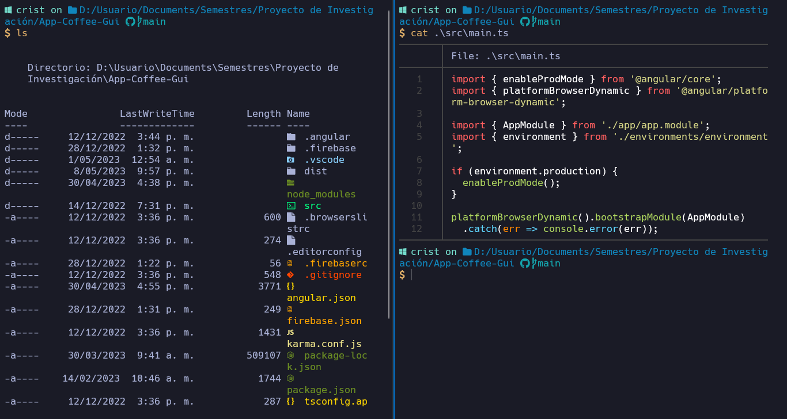
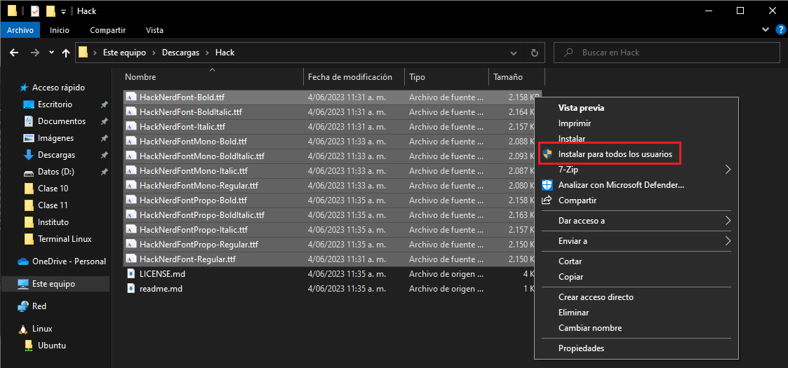
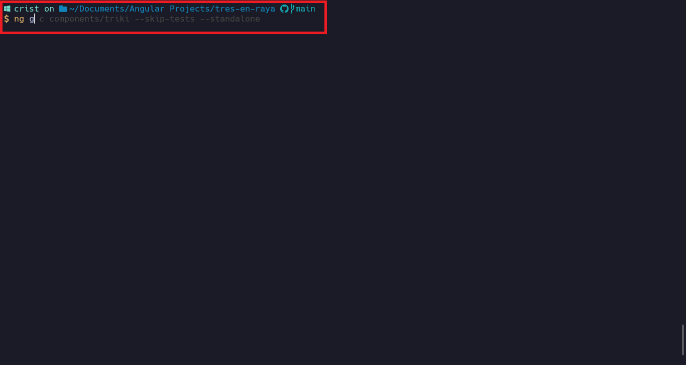
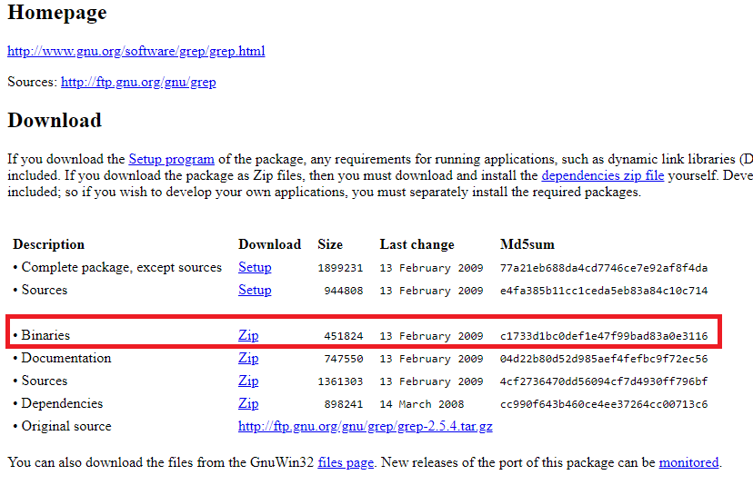

# Configuración de la terminal de Windows

Configuración de la terminal de Windows (perfil de PowerShell) con las [Hack Nerd Fonts](https://www.nerdfonts.com/), [oh my posh](https://ohmyposh.dev) y una apariencia similar a la powerlevel10k.

## Resultado final 



## Instalación 

1. Instalación de las _Hack Nerd Fonts_: descargamos el comprimido de las _Hack Nerd Fonts_ de la página oficial ([Hack Nerd Fonts](https://www.nerdfonts.com/font-downloads)), posteriormente descomprimimos el archivo _.zip_, seleccionamos todas las fuentes y damos clic derecho ***instalar para todos los usuarios***. 



2.  [Instalación de oh my posh](https://ohmyposh.dev/docs/installation/windows): a través de powershell se ejecuta el siguiente comando.

```powershell
winget install JanDeDobbeleer.OhMyPosh -s winget
```

Una vez termine el proceso de instalación, se debe crear un perfil editar el perfil de inicio de la siguiente manera:

```powershell
notepad $PROFILE
```

Si el anterior comando da un error relacionado con la inexistencia de la variable de entorno se debe crear con el siguiente comando:

```powershell
New-Item -Path $PROFILE -Type File -Force
```

Una vez abra el archivo ubicado en la ruta _C:\\Users\\\<usuario\>\\OneDrive\\Documents\\WindowsPowerShell\\Microsoft.PowerShell_profile.ps1_  se debe agregar la siguiente línea:

```powershell
oh-my-posh init pwsh | Invoke-Expression
```

Y finalmente, se debe recargar el perfil:

```powershell
. $PROFILE
```

En este punto debería cargase la configuración de oh my posh por defecto

3. Personalización de Oh My Posh: con el comando `Get-PoshThemes` se listarán todos los temas disponibles en Oh My Posh (o visita la página de [temas](https://ohmyposh.dev/docs/themes) de Oh My Posh), deberá escoger uno y agregar el nombre en el archivo _C:\\Users\\\<usuario\>\\OneDrive\\Documents\\WindowsPowerShell\\Microsoft.PowerShell_profile.ps1_ de la siguiente menera:

```powershell
oh-my-posh init pwsh --config "$env:POSH_THEMES_PATH\<nombre_del_tema>.omp.json" | Invoke-Expression
```
_Nota: tema actualmente en uso **amro**, en el repositorio está el archivo reconfigurado_

4. Instalación de iconos: para tener iconos en la consola se usará el reapositorio [Terminal-Icons](https://github.com/devblackops/Terminal-Icons), a continuación su instalación. Este proceso de sebe **ejecutar como administrador**.

```powershell
Install-Module -Name Terminal-Icons -Repository PSGallery
```

Una vez termine la instalción se debe agregar la siguiente línea en el archivo _C:\\Users\\\<usuario\>\\OneDrive\\Documents\\WindowsPowerShell\\Microsoft.PowerShell_profile.ps1_

```powershell
Import-Module -Name Terminal-Icons
````

5. Instalación de bat: con el paquete _bat_ se conseguirá una mejor estética a la hora de visualizar archivos. Bat se instala a través de ***scoop***, de no contar con este gestor de paquetes ejecute los siguientes comando.

```powershell
Set-ExecutionPolicy RemoteSigned -Scope CurrentUser # Optional: Needed to run a remote script the first time
irm get.scoop.sh | iex
```

Una vez instalado scoop ejecute el sigueinte comando para instalar _bat_.

```powershell
scoop install bat
```

Para usar _bat_ como el tipico _cat_ de sistemas Unix se asignará un alias a este comando. Se debe añadir las siguientes líneas al archivo _C:\\Users\\\<usuario\>\\OneDrive\\Documents\\WindowsPowerShell\\Microsoft.PowerShell_profile.ps1_.

```powershell
Del alias:cat
New-Alias -Name cat -Value bat
```
## Instalación de PSReadLine (Autosugerencia con base al historial)



6. Instalación de PSReadLine: con la utilidad [_PSRealLine_](https://learn.microsoft.com/en-us/powershell/module/psreadline/about/about_psreadline?view=powershell-7.3) se agrega un auto sugerido a la terminal en función del historial de comandos ejecutados. Para la instalación se debe ejecutar los siguientes comandos como ***Administrador***.

```powershell
Install-Module -Name PSReadLine -AllowClobber -Force
Set-PSReadLineOption -PredictionSource History
```

## Archivos de configuración

En este repositorio se encuentra los siguientes archivos de configuración, en cada archivo se encuentra comentada la ruta donde debe ser copiado:
- settings.json (Configuración de la terminal)
- WindowsPowerShell\Microsoft.PowerShell_profile.ps1 (Archivo de perfil tema e con iconos configurado)
- amro.omp.json (Archivo del tema actualmente en uso Path: C:\\Users\\\<usuario\>\\AppData\\Local\\Programs\\oh-my-posh\\themes\\amro.omp.json)

## Instalación de algúnos programas Unix para Windows
Los siguinetes programas se descargan de la página de [GNUWin32](https://gnuwin32.sourceforge.net/packages.html) y [exiftools](https://exiftool.org/), se recomienda descargar el binario. Se debe añadir al ***PATH*** la siguiente ruta: C:\\Program Files (x86)\\GnuWin32\\bin
Para el caso de ***exiftools*** se debe descomprimir el binario en dicha ruta y renombrarlo como "exiftool" en caso de ser necesario.



- [awk](https://gnuwin32.sourceforge.net/packages/gawk.htm)
- [diff](https://gnuwin32.sourceforge.net/packages/diffutils.htm)
- [exiftools](https://exiftool.org/)
- [file](https://gnuwin32.sourceforge.net/packages/file.htm)
- [grep](https://gnuwin32.sourceforge.net/packages/grep.htm)
- [mdcat](https://github.com/swsnr/mdcat/releases)
- [sed](https://gnuwin32.sourceforge.net/packages/sed.htm)
- [tree](https://gnuwin32.sourceforge.net/packages/tree.htm)
- wget (vía choco `choco install wget`)
- [which](https://gnuwin32.sourceforge.net/packages/which.htm)


## Lista de shortcuts 

<table style="font-family: arial, sans-serif; border-collapse: collapse; width: 100%;">
	<tr style="border: 1px solid #dddddd; text-align: left; padding: 8px;">
		<td style="border: 1px solid #dddddd; text-align: left; padding: 8px;"><strong>Shortcut</strong></td>
		<td style="border: 1px solid #dddddd; text-align: left; padding: 8px;"><strong>Acción</strong></td>
	</tr>
	<tr  style="border: 1px solid #dddddd; text-align: left; padding: 8px;">
		<td style="border: 1px solid #dddddd; text-align: left; padding: 8px;">ctrl + shift + enter</td>
		<td style="border: 1px solid #dddddd; text-align: left; padding: 8px;">Abre un nuevo panel (split)</td>
	</tr>
	<tr  style="border: 1px solid #dddddd; text-align: left; padding: 8px;">
		<td style="border: 1px solid #dddddd; text-align: left; padding: 8px;">ctrl + &ltflechas de dirección&gt</td>
		<td style="border: 1px solid #dddddd; text-align: left; padding: 8px;">Desplazamiento entre paneles</td>
	</tr>
	<tr  style="border: 1px solid #dddddd; text-align: left; padding: 8px;">
		<td style="border: 1px solid #dddddd; text-align: left; padding: 8px;">ctrl + shift + w</td>
		<td style="border: 1px solid #dddddd; text-align: left; padding: 8px;">Cierra el panel actual</td>
	</tr>
	<tr  style="border: 1px solid #dddddd; text-align: left; padding: 8px;">
		<td style="border: 1px solid #dddddd; text-align: left; padding: 8px;">ctrl + shift + &ltflechas&gt</td>
		<td style="border: 1px solid #dddddd; text-align: left; padding: 8px;">Cambia de tamaño los paneles</td>
	</tr>
	<tr  style="border: 1px solid #dddddd; text-align: left; padding: 8px;">
		<td style="border: 1px solid #dddddd; text-align: left; padding: 8px;">ctrl + shift + t</td>
		<td style="border: 1px solid #dddddd; text-align: left; padding: 8px;">Nueva pestaña</td>
	</tr>
	<tr  style="border: 1px solid #dddddd; text-align: left; padding: 8px;">
		<td style="border: 1px solid #dddddd; text-align: left; padding: 8px;">ctrl + tab</td>
		<td style="border: 1px solid #dddddd; text-align: left; padding: 8px;">Cambia entre pestañas</td>
	</tr>
	<tr  style="border: 1px solid #dddddd; text-align: left; padding: 8px;">
		<td style="border: 1px solid #dddddd; text-align: left; padding: 8px;">ctrl + r</td>
		<td style="border: 1px solid #dddddd; text-align: left; padding: 8px;">Historial de comandos</td>
	</tr>
	<tr  style="border: 1px solid #dddddd; text-align: left; padding: 8px;">
		<td style="border: 1px solid #dddddd; text-align: left; padding: 8px;">ctrl + alt + clic</td>
		<td style="border: 1px solid #dddddd; text-align: left; padding: 8px;">Selección en forma rectangular</td>
	</tr>
	<tr  style="border: 1px solid #dddddd; text-align: left; padding: 8px;">
		<td style="border: 1px solid #dddddd; text-align: left; padding: 8px;">ctrl + shift + l</td>
		<td style="border: 1px solid #dddddd; text-align: left; padding: 8px;">Alterna horizontal-vertical los paneles</td>
	</tr>
	<tr  style="border: 1px solid #dddddd; text-align: left; padding: 8px;">
		<td style="border: 1px solid #dddddd; text-align: left; padding: 8px;">ctrl + shift + z</td>
		<td style="border: 1px solid #dddddd; text-align: left; padding: 8px;">Alterna zoom del panel actual</td>
	</tr>
</table>
